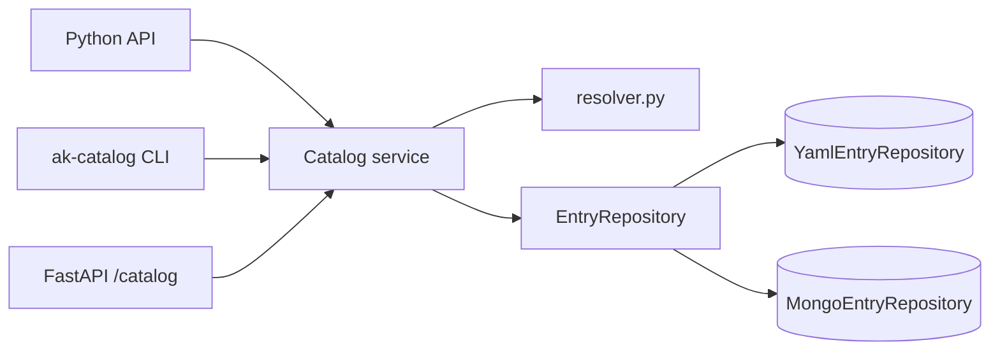

# akgentic-catalog

[](https://github.com/b12consulting/akgentic-catalog/actions/workflows/ci.yml)
[](https://github.com/b12consulting/akgentic-catalog/actions/workflows/ci.yml)

Configuration management for the
[Akgentic](https://github.com/b12consulting/akgentic-quick-start) multi-agent
framework. Store, query, clone, validate, and resolve versioned
configuration **entries** (teams, agents, tools, prompts, models, and any
allowlisted Pydantic model) through a single unified `Catalog` service
backed by a pluggable `EntryRepository`.

## Table of Contents

- [Overview](#overview)
- [Installation](#installation)
- [Quick Start](#quick-start)
- [Architecture](#architecture)
- [The Entry Model](#the-entry-model)
- [Storage Backends](#storage-backends)
- [References Between Entries](#references-between-entries)
- [Querying the Catalog](#querying-the-catalog)
- [CLI](#cli)
- [REST API](#rest-api)
- [Development](#development)
- [License](#license)

## Overview

Version 2 of `akgentic-catalog` replaces the v1 four-catalog split
(templates, tools, agents, teams each with its own service, repository,
model, and query) with a single `Entry` model, a single `Catalog` service,
and a single `EntryRepository` protocol. An entry is identified by the
compound key `(kind, namespace, id)` and carries an opaque, schema-validated
`payload` sized for any allowlisted Pydantic model type.

Key properties:

- **Unified `Entry` model** — one Pydantic shape for every kind of
  configuration. Built-in kinds include `team`, `agent`, `tool`,
  `prompt`, and `model`, and arbitrary new kinds are allowed as long as
  the payload's `model_type` resolves through the `akgentic.*` allowlist.
- **Namespaces as tenancy / environment boundaries.** Each namespace is a
  self-contained bundle: one `team` root entry plus any number of
  sub-entries referencing it.
- **Two-phase ref model** — sub-entries embed sentinel
  `{"__ref__": "<id>", "__type__": "<model_type>"}` dicts where the team
  references them; the resolver walks these refs (with cycle detection)
  to produce a fully-populated runtime object.
- **Pluggable storage** — YAML-file-per-entry and MongoDB single-collection
  backends ship in the box behind the `EntryRepository` protocol.
- **Namespace bundles** — export/import a whole namespace (team + all
  sub-entries) as a single YAML document for round-tripping between
  environments.
- **CLI and REST API** — manage entries and bundles outside of Python.

Architecture details live in
[`_bmad-output/akgentic-catalog/architecture/10-package-structure.md`](../../_bmad-output/akgentic-catalog/architecture/10-package-structure.md)
(package layout), `05-validation.md` (validation rules), and
`06-service-and-env.md` (the service pipeline).

## Installation

### Workspace Installation (Recommended)

This package is designed for use within the Akgentic monorepo workspace:

```bash
git clone git@github.com:b12consulting/akgentic-quick-start.git
cd akgentic-quick-start
git submodule update --init --recursive

uv venv
source .venv/bin/activate
uv sync --all-packages --all-extras
```

All dependencies (`akgentic-core`, `akgentic-llm`, `akgentic-tool`,
`akgentic-team`) resolve automatically via workspace configuration.

### Optional Extras

| Extra   | Packages pulled in     | Enables                              |
|---------|------------------------|--------------------------------------|
| `api`   | `fastapi`, `uvicorn`   | `create_app()` FastAPI factory       |
| `cli`   | `typer`, `rich`        | `ak-catalog` console script          |
| `mongo` | `pymongo`              | `MongoEntryRepository`               |

```bash
uv sync --extra api
uv sync --extra cli
uv sync --extra mongo
uv sync --all-extras
```

## Quick Start

Create a fresh YAML-backed catalog, seed a team namespace, and resolve it:

```python
import tempfile
from pathlib import Path

from akgentic.catalog import (
    Catalog,
    Entry,
    UNSET_NAMESPACE,
    YamlEntryRepository,
)

with tempfile.TemporaryDirectory() as tmp:
    repo = YamlEntryRepository(Path(tmp))
    catalog = Catalog(repo)

    # Create the team root with a to-be-minted namespace.
    team = Entry(
        id="research-team",
        kind="team",
        namespace=UNSET_NAMESPACE,
        user_id="u1",
        model_type="akgentic.team.models.TeamCard",
        payload={
            "name": "Research Team",
            "entry_point": {
                "__ref__": "lead-agent",
                "__type__": "akgentic.core.AgentCard",
            },
            "members": [],
        },
    )
    team = catalog.create(team)          # namespace replaced by a fresh UUID
    namespace = team.namespace

    # Create a sub-entry in the same namespace.
    agent = catalog.create(Entry(
        id="lead-agent",
        kind="agent",
        namespace=namespace,
        user_id="u1",
        model_type="akgentic.core.AgentCard",
        payload={"role": "Lead", "description": "Coordinates the team"},
    ))

    # Read / resolve.
    stored_team = catalog.get(namespace=namespace, id="research-team")
    team_card = catalog.load_team(namespace)  # TeamCard with refs populated
```

See the architecture shards for a namespace-bundle walkthrough and YAML
authoring guidance.

## Architecture



The runtime layout under `src/akgentic/catalog/` mirrors shard 10:

```
src/akgentic/catalog/
    __init__.py          Public API (Catalog, Entry, EntryKind, EntryQuery, ...)
    catalog.py           Unified Catalog service (CRUD + clone + resolve + load_team)
    resolver.py          Two-phase ref resolver + allowlisted model loader
    env.py               ${VAR} substitution for YAML payloads
    serialization.py     Namespace bundle load/dump
    validation.py        Namespace-level validation report
    models/              Entry, EntryKind, EntryQuery, CloneRequest, errors
    repositories/        EntryRepository protocol + YAML + Mongo impls
    api/                 FastAPI app + /catalog router
    cli/                 Typer ak-catalog app
```

### Layered invariants (enforced by `Catalog`)

- **Namespace bootstrap** — non-team entries require a pre-existing team
  entry in the same namespace.
- **Namespace minting** — creating a team with `namespace=UNSET_NAMESPACE`
  mints a fresh UUID before any other pipeline step runs.
- **Ownership propagation** — every sub-entry inherits the team's `user_id`.
- **Delete guards** — deleting an entry referenced by another entry in the
  same namespace raises `CatalogValidationError` listing inbound referrers.
- **Clone atomicity** — `clone` collects every intended write in memory and
  emits them in a single pass; partial failures leave the destination
  untouched.

## The Entry Model

Every catalog row is an `Entry`:

```python
from akgentic.catalog import Entry, EntryKind

Entry(
    id="lead-agent",              # stable within (kind, namespace)
    kind=EntryKind.AGENT,          # "team" | "agent" | "tool" | "prompt" | "model" | ...
    namespace="tenant-42",         # tenancy / environment boundary
    user_id="u1",                  # ownership; propagated from the team
    model_type="akgentic.core.AgentCard",  # allowlisted Pydantic class
    payload={"role": "Lead", "description": "..."},
)
```

`model_type` is a dotted path to a Pydantic `BaseModel` subclass under the
`akgentic.*` allowlist; the resolver calls
`akgentic.catalog.resolver.load_model_type` to materialize it. Payloads
validate against that class at create/update time.

## Storage Backends

### YAML (default)

`YamlEntryRepository(root)` lays out one file per entry, namespaced
directory per namespace, partitioned by kind:

```
<root>/
  <namespace>/
    team/research-team.yaml
    agent/lead-agent.yaml
    tool/web-search.yaml
```

```python
from akgentic.catalog import Catalog, YamlEntryRepository
catalog = Catalog(YamlEntryRepository("./catalog"))
```

### MongoDB

`MongoEntryRepository` stores every entry in a single collection indexed by
the compound `(kind, namespace, id)` key. Install the `mongo` extra and
provide a connection:

```python
from akgentic.catalog import Catalog, MongoCatalogConfig, MongoEntryRepository

cfg = MongoCatalogConfig(
    connection_string="mongodb://localhost:27017",
    database="akgentic",
)
catalog = Catalog(MongoEntryRepository(cfg))
```

Both backends expose the same `EntryRepository` protocol; parity tests
under `tests/v2/test_entry_repo_parity.py` keep them interchangeable.

## References Between Entries

Sub-entries are embedded in the team payload (and in each other) as
sentinel ref dicts, not by plain ID strings. A ref is a two-key dict:

```python
{"__ref__": "<entry-id>", "__type__": "<model_type>"}
```

The constants `REF_KEY` and `TYPE_KEY` are re-exported from
`akgentic.catalog` for construction/inspection. The resolver walks these
refs in two phases — `populate_refs` (ensures every ref resolves to a
known entry) and `resolve` (materializes the runtime Pydantic object) —
with cycle detection. See `architecture/05-validation.md` and
`architecture/06-service-and-env.md` for the full rules.

## Querying the Catalog

`EntryQuery` is the single query model for all kinds. Any subset of
filters may be provided; unspecified filters are ignored.

```python
from akgentic.catalog import EntryQuery

# Every entry in a namespace.
catalog.list_by_namespace("tenant-42")

# Cross-namespace filter.
catalog.list(EntryQuery(kind="agent", user_id="u1"))

# Parent-chain lookup (for clones).
catalog.list(EntryQuery(parent_namespace="tenant-42", parent_id="research-team"))
```

## CLI

The optional `ak-catalog` console script (enabled by `--extra cli`)
mounts a Typer app with one subcommand group per kind plus top-level
verbs for namespace-scoped and schema operations.

```bash
# Kind-scoped CRUD.
ak-catalog --root ./catalog team list --namespace tenant-42
ak-catalog --root ./catalog agent get --namespace tenant-42 lead-agent
ak-catalog --root ./catalog agent create ./lead-agent.yaml

# Namespace bundle round-trip.
ak-catalog --root ./catalog export --namespace tenant-42 > tenant-42.yaml
ak-catalog --root ./catalog import ./tenant-42.yaml

# Validation & schema.
ak-catalog --root ./catalog validate --namespace tenant-42
ak-catalog --root ./catalog validate ./tenant-42.yaml   # dry-run from bundle
ak-catalog schema akgentic.core.AgentCard
ak-catalog model-types                                  # list allowlisted types
```

Full reference: [docs/cli-usage-guide.md](docs/cli-usage-guide.md).

## REST API

The optional FastAPI app (enabled by `--extra api`) mounts the `/catalog`
router. Start it in-process:

```bash
uvicorn "akgentic.catalog:create_app" --factory
```

Backend is selected via environment variables at app-factory time
(YAML by default; set `AKGENTIC_CATALOG_BACKEND=mongo` plus connection
fields for MongoDB). Error responses map catalog exceptions to HTTP:

| Status | Cause                                   |
|--------|-----------------------------------------|
| `404`  | `EntryNotFoundError`                    |
| `409`  | `CatalogValidationError`                |
| `422`  | Pydantic `ValidationError` on payload   |

See `src/akgentic/catalog/api/router.py` for the full endpoint surface
(CRUD per kind, namespace bundle export/import, schema, resolve, validate).

## Development

### Prerequisites

- Python 3.12+
- [uv](https://docs.astral.sh/uv/) package manager

### Setup

```bash
uv sync --all-extras
```

### Commands

```bash
# Run tests
uv run pytest tests/

# Run tests with coverage
uv run pytest tests/ --cov=akgentic.catalog --cov-fail-under=80

# Lint
uv run ruff check src/ tests/

# Format
uv run ruff format src/ tests/

# Type check
uv run mypy src/
```

## License

See the repository root for license information.
