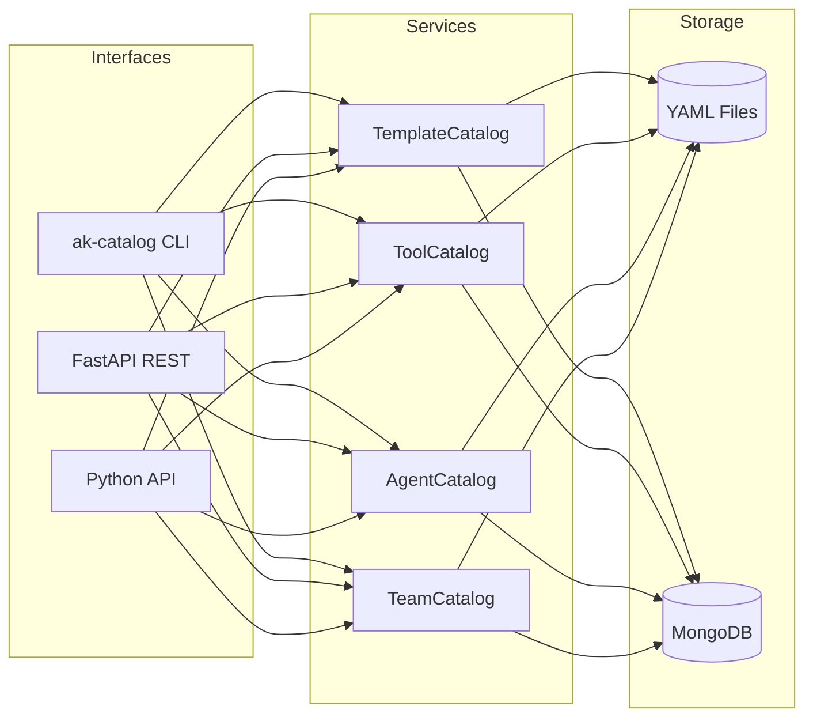
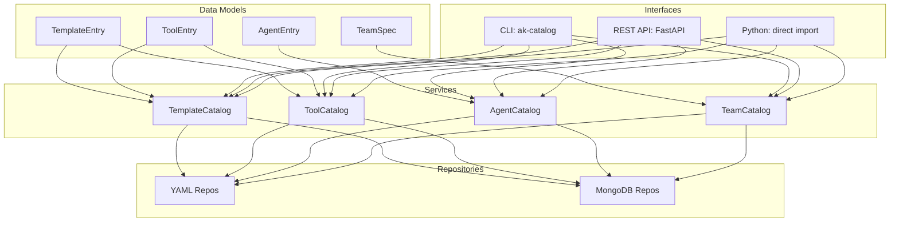

# akgentic-catalog

[](https://github.com/b12consulting/akgentic-catalog/actions/workflows/ci.yml)
[](https://github.com/b12consulting/akgentic-catalog/actions/workflows/ci.yml)

Configuration management for the [Akgentic](https://github.com/b12consulting/akgentic-quick-start)
multi-agent framework. Register, validate, query, and persist **templates**,
**tools**, **agents**, and **teams** through a unified catalog layer with
pluggable storage backends.

## Table of Contents

- [Overview](#overview)
- [Installation](#installation)
- [Quick Start](#quick-start)
- [Architecture](#architecture)
- [Catalog Entries](#catalog-entries)
- [Storage Backends](#storage-backends)
- [Service Layer](#service-layer)
- [Querying the Catalog](#querying-the-catalog)
- [CLI](#cli)
- [REST API](#rest-api)
- [Examples](#examples)
- [Development](#development)
- [License](#license)

## Overview

`akgentic-catalog` replaces hard-coded Python setup with persistent,
queryable CRUD registries for every component in the Akgentic actor system.
It sits between static configuration (YAML files, Python constructors) and
the runtime orchestrator, providing:

- **Pydantic-first models** for all catalog entries with full validation
- **Cross-catalog validation** (tool references, template parameters, agent
  routing, team membership)
- **Delete protection** preventing removal of entries referenced downstream
- **Dynamic type resolution** via fully-qualified class names (FQCN),
  enabling custom ToolCard, AgentConfig, and Agent subclasses
- **Two storage backends** (YAML files and MongoDB) behind a common
  repository interface
- **CLI and REST API** for managing catalogs outside of Python code



## Installation

### Workspace Installation (Recommended)

This package is designed for use within the Akgentic monorepo workspace:

```bash
git clone git@github.com:b12consulting/akgentic-quick-start.git
cd akgentic-quick-start
git submodule update --init --recursive

uv venv
source .venv/bin/activate
uv sync --all-packages --all-extras
```

All dependencies (`akgentic-core`, `akgentic-llm`, `akgentic-tool`,
`akgentic-agent`) resolve automatically via workspace configuration.

### Optional Extras

```bash
# REST API (FastAPI + Uvicorn)
uv sync --extra api

# CLI (Typer + Rich)
uv sync --extra cli

# MongoDB backend
uv sync --extra mongo

# Everything
uv sync --all-extras
```

## Quick Start

Create catalog entries in Python, register them, and query:

```python
import tempfile
from pathlib import Path

from akgentic.catalog import (
    AgentCatalog,
    AgentEntry,
    TeamCatalog,
    TeamMemberSpec,
    TeamSpec,
    TemplateCatalog,
    TemplateEntry,
    ToolCatalog,
    ToolEntry,
    YamlAgentCatalogRepository,
    YamlTeamCatalogRepository,
    YamlTemplateCatalogRepository,
    YamlToolCatalogRepository,
)
from akgentic.core import AgentCard
from akgentic.llm import ModelConfig, PromptTemplate
from akgentic.agent.config import AgentConfig

# Wire catalogs with temp directories (or use real paths)
with tempfile.TemporaryDirectory() as tmp:
    base = Path(tmp)
    template_catalog = TemplateCatalog(
        YamlTemplateCatalogRepository(base / "templates")
    )
    tool_catalog = ToolCatalog(
        YamlToolCatalogRepository(base / "tools")
    )
    agent_catalog = AgentCatalog(
        YamlAgentCatalogRepository(base / "agents"),
        template_catalog,
        tool_catalog,
    )
    team_catalog = TeamCatalog(
        YamlTeamCatalogRepository(base / "teams"),
        agent_catalog,
    )

    # Register a template
    template_catalog.create(TemplateEntry(
        id="researcher-prompt",
        template="You are a {role} researching {topic}.",
    ))

    # Register a tool (FQCN points to a ToolCard subclass)
    tool_catalog.create(ToolEntry(
        id="search",
        tool_class="akgentic.tool.search.search.SearchTool",
    ))

    # Register an agent referencing the tool
    agent_catalog.create(AgentEntry(
        id="researcher",
        tool_ids=["search"],
        card=AgentCard(
            role="Researcher",
            description="Finds relevant information",
            skills=["research", "analysis"],
            agent_class="akgentic.agent.agent.BaseAgent",
            config=AgentConfig(
                name="@Researcher",
                role="Researcher",
                prompt=PromptTemplate(
                    template="You are a research specialist.",
                ),
                model_cfg=ModelConfig(
                    provider="openai", model="gpt-4.1",
                ),
            ),
        ),
    ))

    # Register a team
    team_catalog.create(TeamSpec(
        id="research-team",
        name="Research Team",
        entry_point="researcher",
        members=[TeamMemberSpec(agent_id="researcher")],
    ))

    # Query the catalog
    team = team_catalog.get("research-team")
    print(f"Team: {team.name}, entry_point: {team.entry_point}")
```

## Architecture

The package follows a four-tier architecture with strict upward dependency
flow:



### Layer Responsibilities

| Layer | Role |
|---|---|
| **Models** | Pydantic models with schema validation, FQCN resolution, computed properties |
| **Repositories** | Storage abstraction — CRUD + search behind a common interface |
| **Services** | Cross-catalog validation, delete protection, upstream/downstream wiring |
| **Interfaces** | CLI commands, REST endpoints, and direct Python imports |

### Catalog Dependency Chain

Catalogs must be constructed in dependency order because upstream catalogs
validate references:

```
TemplateCatalog + ToolCatalog  (independent — no cross-references)
        ↓               ↓
      AgentCatalog       (validates tool_ids, @template refs, routes_to)
            ↓
      TeamCatalog        (validates member agent_ids, entry_point, message_types)
```

## Catalog Entries

### TemplateEntry

Reusable prompt templates with auto-parsed placeholders.

```python
entry = TemplateEntry(
    id="greeting",
    template="Hello {name}, you are a {role}.",
)
entry.placeholders  # frozenset({"name", "role"})
```

### ToolEntry

Tool configuration with dynamic class resolution via FQCN.

```python
entry = ToolEntry(
    id="search",
    tool_class="akgentic.tool.search.search.SearchTool",
    # tool field auto-resolves from tool_class if omitted
)
isinstance(entry.tool, SearchTool)  # True
```

The `tool_class` string is resolved at validation time using `import_class()`.
Custom `ToolCard` subclasses work seamlessly — define them in any importable
module and reference via FQCN.

### AgentEntry

Agent configuration wrapping `AgentCard` with catalog references.

```python
entry = AgentEntry(
    id="coder",
    tool_ids=["search", "code-exec"],   # validated against ToolCatalog
    card=AgentCard(
        role="Coder",
        description="Writes Python code",
        skills=["python", "debugging"],
        agent_class="akgentic.agent.agent.BaseAgent",
        config=AgentConfig(name="@Coder", role="Coder", ...),
        routes_to=["reviewer"],         # validated against AgentCatalog
    ),
)
```

Cross-validation at `create()`/`update()` time ensures:

- Every `tool_ids` entry exists in ToolCatalog
- `@template-id` references resolve and placeholders match config params
- `routes_to` agent names exist in AgentCatalog

### TeamSpec

Team composition with hierarchical member trees and runtime profiles.

```python
team = TeamSpec(
    id="dev-team",
    name="Development Team",
    entry_point="lead",
    message_types=["akgentic.agent.messages.AgentMessage"],
    members=[
        TeamMemberSpec(agent_id="lead", headcount=1, members=[
            TeamMemberSpec(agent_id="coder", headcount=2),
            TeamMemberSpec(agent_id="reviewer"),
        ]),
    ],
    profiles=["specialist"],  # agents hireable at runtime
)
```

## Storage Backends

### YAML (Default)

One file per entry, organized in directories by catalog type. The YAML
backend uses lazy caching with automatic invalidation on writes.

```bash
catalog/
  templates/
    greeting.yaml
    system-prompt.yaml
  tools/
    search.yaml
  agents/
    researcher.yaml
  teams/
    research-team.yaml
```

```python
from akgentic.catalog import YamlTemplateCatalogRepository
repo = YamlTemplateCatalogRepository(Path("catalog/templates"))
```

### MongoDB

Each catalog type maps to a MongoDB collection. Install the `mongo` extra
and configure with `MongoCatalogConfig`:

```python
from akgentic.catalog import MongoCatalogConfig, MongoTemplateCatalogRepository

config = MongoCatalogConfig(
    connection_string="mongodb://localhost:27017",
    database="akgentic",
)
repo = MongoTemplateCatalogRepository(config)
```

## Service Layer

Service-layer catalogs add cross-validation, delete protection, and
upstream/downstream wiring on top of raw repositories.

### Cross-Validation

Every `create()` and `update()` call validates references against upstream
catalogs. Invalid references raise `CatalogValidationError` with all
errors collected at once:

```python
from akgentic.catalog import CatalogValidationError

try:
    agent_catalog.create(AgentEntry(
        id="broken",
        tool_ids=["nonexistent-tool"],  # does not exist
        card=...,
    ))
except CatalogValidationError as e:
    print(e.errors)  # ["Tool 'nonexistent-tool' not found"]
```

### Delete Protection

Catalogs prevent deletion of entries referenced by downstream catalogs:

- Deleting a **template** referenced by an agent raises an error
- Deleting a **tool** referenced in agent `tool_ids` raises an error
- Deleting an **agent** referenced by a team or another agent's `routes_to`
  raises an error

Wire downstream back-references after construction:

```python
template_catalog.set_downstream_agent_catalog(agent_catalog)
tool_catalog.set_downstream_agent_catalog(agent_catalog)
agent_catalog.set_downstream_team_catalog(team_catalog)
```

## Querying the Catalog

Each catalog type has a typed query model with field-specific match
semantics:

```python
from akgentic.catalog import AgentQuery, ToolQuery

# Find agents with specific skills (set overlap)
results = agent_catalog.search(AgentQuery(skills=["research"]))

# Find tools by class name (substring match)
results = tool_catalog.search(ToolQuery(tool_class="SearchTool"))

# Cross-catalog chaining: find teams containing research agents
agents = agent_catalog.search(AgentQuery(skills=["research"]))
for agent in agents:
    teams = team_catalog.search(TeamQuery(agent_id=agent.id))
```

| Query Model | Filter Fields | Match Type |
|---|---|---|
| `TemplateQuery` | `id`, `placeholder` | exact, membership |
| `ToolQuery` | `id`, `tool_class`, `name`, `description` | exact, substring |
| `AgentQuery` | `id`, `role`, `skills`, `description` | exact, set overlap, substring |
| `TeamQuery` | `id`, `name`, `description`, `agent_id` | exact, substring, tree walk |

## CLI

The `ak-catalog` command provides full CRUD and management operations.
See the [CLI Usage Guide](docs/cli-usage-guide.md) for complete
documentation.

```bash
# List all agents (table format by default)
ak-catalog agent list

# Get a specific entry as JSON
ak-catalog tool get search --format json

# Create from a YAML file
ak-catalog template create prompt.yaml

# Search agents by skill
ak-catalog agent search --skill research

# Import entries from a Python file
ak-catalog import entries.py

# Validate cross-reference consistency
ak-catalog validate

# Use MongoDB backend
ak-catalog --backend mongodb --mongo-uri mongodb://localhost:27017 agent list
```

### Output Formats

Use `--format` to switch between `table` (default), `json`, and `yaml`.

## REST API

Start the FastAPI server with configurable backend:

```bash
# YAML backend (default)
uvicorn "akgentic.catalog.api:create_app()" --factory

# MongoDB backend
CATALOG_BACKEND=mongodb MONGO_URI=mongodb://localhost:27017 \
  uvicorn "akgentic.catalog.api:create_app()" --factory
```

### Endpoints

All four catalog types expose identical CRUD routes:

| Method | Path | Description |
|---|---|---|
| `POST` | `/api/{type}/` | Create entry |
| `GET` | `/api/{type}/` | List all entries |
| `GET` | `/api/{type}/{id}` | Get entry by ID |
| `POST` | `/api/{type}/search` | Search with query model |
| `PUT` | `/api/{type}/{id}` | Update entry |
| `DELETE` | `/api/{type}/{id}` | Delete entry |

Where `{type}` is one of: `templates`, `tools`, `agents`, `teams`.

### Error Responses

| Status | Cause |
|---|---|
| `404` | Entry not found (`EntryNotFoundError`) |
| `409` | Business rule violation (`CatalogValidationError`) |
| `422` | Schema validation failure (Pydantic `ValidationError`) |

## Examples

Eight progressive, self-contained examples in the [examples/](examples/)
directory. See the [Examples README](examples/README.md) for full
descriptions and running instructions. Each includes a runnable `.py`
script and a companion `.md` explaining concepts and pitfalls.

```bash
# Run any example from the package directory
cd packages/akgentic-catalog
uv run python examples/01_catalog_entries.py
```

| # | Script | Topic |
|---|---|---|
| 01 | `01_catalog_entries.py` | Template & Tool Entry Basics |
| 02 | `02_agent_entries.py` | Agent Entries & Cross-Validation |
| 03 | `03_team_specs.py` | Team Composition, Member Trees & Profiles |
| 04 | `04_yaml_persistence.py` | YAML Repository Round-Trip |
| 05 | `05_catalog_wiring.py` | Full Catalog Wiring, Delete Protection & Env Vars |
| 06 | `06_search_and_query.py` | Compound Queries & Cross-Catalog Search |
| 07 | `07_python_first.py` | Python-First Workflows |
| 08 | `08_custom_types.py` | Custom Types & FQCN Round-Trip |

## Development

### Prerequisites

- Python 3.12+
- [uv](https://docs.astral.sh/uv/) package manager

### Setup

```bash
uv sync --all-extras
```

### Commands

```bash
# Run tests
uv run pytest tests/

# Run tests with coverage
uv run pytest tests/ --cov=akgentic.catalog --cov-fail-under=80

# Lint
uv run ruff check src/

# Format
uv run ruff format src/

# Type check
uv run mypy src/
```

### Project Structure

```
src/akgentic/catalog/
    __init__.py          # Public API (30+ exports)
    env.py               # ${VAR} environment variable substitution
    refs.py              # @-reference resolution utilities
    models/              # Pydantic data models and query types
    repositories/        # Abstract base + YAML and MongoDB implementations
    services/            # Catalog services with cross-validation
    api/                 # FastAPI routers and app factory
    cli/                 # Typer CLI commands and output formatting
examples/                # 8 progressive examples with companion docs
tests/                   # 638 tests organized by domain
```

## License

See the repository root for license information.
