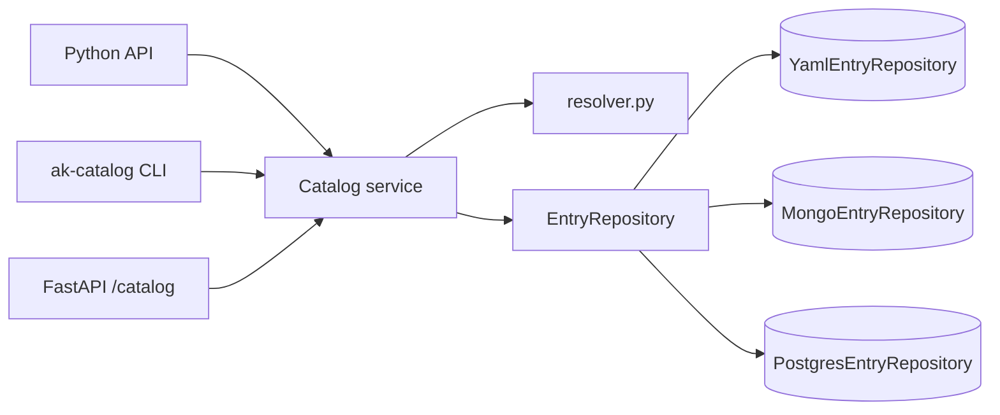

# akgentic-catalog

[](https://github.com/b12consulting/akgentic-catalog/actions/workflows/ci.yml)
[](https://github.com/b12consulting/akgentic-catalog/actions/workflows/ci.yml)

A serialisation / deserialisation layer for Pydantic models, with pluggable
persistence. You declare a model; the catalog validates a payload against it on
write and rehydrates it through the same model on read. Its `__ref__` pattern
lets a stored payload compose itself from other stored payloads **discovered by
name**, so a value lives in one place and is referenced rather than copied.

Built for the
[Akgentic](https://github.com/b12consulting/akgentic-framework) multi-agent
framework (open-source bundle) — teams, agents, tools, prompts and models are
the shapes it stores out of the box — but the storable set is open: any
Pydantic model whose dotted path is on the deployment's allowlist.

Entries are grouped into **namespaces**, and the usual unit is one agent team:
its team card, plus the agents, tools and prompts that team is built from. A
namespace is the boundary for referencing, for export and import, and for who
may see or copy it. A namespace need not define a team — a shared library
namespace holds only the models and tools that other namespaces reference.

## Table of Contents

- [Overview](#overview)
- [The round trip](#the-round-trip)
- [Installation](#installation)
- [Quick Start](#quick-start)
- [Architecture](#architecture)
- [The Entry Model](#the-entry-model)
- [Unknown keys are errors](#unknown-keys-are-errors)
- [Registering customer model types](#registering-customer-model-types)
- [Storage Backends](#storage-backends)
- [Sharing scalars between entries](#sharing-scalars-between-entries)
- [References Between Entries](#references-between-entries)
- [Querying the Catalog](#querying-the-catalog)
- [CLI](#cli)
- [REST API](#rest-api)
- [Development](#development)
- [License](#license)

## Overview

The catalog is one shape and one service. An `Entry` is addressed by the
compound key `(kind, namespace, id)` and carries a `payload` validated against
the Pydantic class its `model_type` names. A single `Catalog` service owns every
operation — create, query, clone, validate, resolve — and reaches storage
through a single `EntryRepository` protocol, so which database is behind it is a
deployment choice rather than a change to any calling code.

Key properties:

- **Unified `Entry` model** — one Pydantic shape for every kind of
  configuration. `kind` is a closed set of six — `team`, `agent`, `tool`,
  `prompt`, `model` and `meta` — while what an entry may *hold* is open: any
  Pydantic class whose `model_type` resolves through the configured prefix
  allowlist (`akgentic.` always, widenable per deployment).
- **One namespace, one agent team.** The namespace is the core organising
  principle, not a folder: it holds a team card plus the agents, tools, prompts
  and models that team is built from. `__ref__` resolution is namespace-bounded
  by default, export and import move a whole namespace at a time, and
  visibility is decided per namespace. Two teams are two namespaces.

  Two entries play distinct roles inside one. Either is enough to *bootstrap* a
  namespace — see the anchor invariant below — but they are not two ways of
  saying the same thing:
  - The **`team` entry defines the team** — it is domain content, the root the
    agents hang off. It is **optional**: a *shared library* namespace defines
    no team and exists purely to be referenced. The shipped `global` and
    `global_tools` namespaces are exactly this — model configurations and tools
    that every team's namespace points at, so they are declared once.
  - The **`_meta` entry carries the namespace's own parameters** — its display
    name, description, free-form `properties`, and the `shareable` / `public`
    flags below. It is technical rather than domain content, which is what the
    leading underscore in its reserved id `_meta` marks. On export it is hoisted
    into the bundle header rather than listed among the entries.

- **`shareable` and `public` are two different questions about a namespace**,
  both set on its `_meta` entry and both defaulting to `False`:
  - **`shareable`** — may entries in *other* namespaces reference into this
    one? A cross-namespace marker (`__namespace__`, or the `<ns>.<id>`
    shorthand) resolves only if the target namespace is `shareable: true`;
    otherwise the resolver refuses it. This is what lets a `global` namespace
    hold model configurations and tools that every team's namespace points at,
    instead of each team copying them.
  - **`public`** — may users who do not own this namespace see it and clone
    it? It governs listing and copying at the catalog boundary, and says
    nothing about references.

  They are independent: a namespace can be referenceable but not browsable, or
  browsable but closed to references. Ownership is a third, separate axis —
  `user_id` on the entry.
- **A ref marker is a pure pointer** — a payload embeds
  `{"__ref__": "<entry-id>"}` wherever it wants another entry's content,
  optionally alongside `__type__` and `__namespace__`. Those three keys are
  the whole vocabulary: any other key next to `__ref__` is a validation
  error. The resolver follows the markers (with cycle detection) to produce a
  fully-populated runtime object, and a `NativeValue` entry lets a bare scalar
  be shared the same way.
- **Pluggable storage** — YAML-file-per-entry, MongoDB single-collection and
  PostgreSQL single-table backends ship in the box behind the
  `EntryRepository` protocol.
- **Namespace bundles** — export/import every entry in a namespace as a
  single YAML document for round-tripping between environments.
- **CLI and REST API** — manage entries and bundles outside of Python.

## The round trip

The catalog stores Pydantic models, not free-form documents. Declare the model
once, anywhere importable, deriving from the framework's
`SerializableBaseModel`:

```python
from akgentic.core.utils import SerializableBaseModel

class CaseIngestionConfig(SerializableBaseModel):
    source: str
    batch_size: int = 100
```

`SerializableBaseModel` is the base every catalog model should use, and the base
the framework's own shapes already use — `AgentCard`, `ToolCard` and the team
cards all derive from it. It stamps a `__model__` tag carrying the class's
dotted path into each dump and strips it again on load, which is what lets a
**polymorphic** field recover its concrete subclass: a `list[ToolCard]` payload
rehydrates as the real `SearchTool` and `WorkspaceTool` instances rather than as
the abstract base. For a field typed as a concrete class a plain `BaseModel`
happens to work — `akgentic.llm.PromptTemplate` is one — but it will not survive
being referenced from a polymorphic position, which is why the rule is stated as
one base rather than two cases.

An entry names it in `model_type` and carries its data in `payload`. On write
the payload is validated against that class — a key the model does not declare
is an error, never a silent drop — and on read it is rehydrated through the same
class. Where a payload wants a value that already lives somewhere else, it
writes a `__ref__` marker instead of a copy, and the resolver splices the target
in at load time:

```python
from akgentic.catalog import Entry

# `catalog` is a Catalog instance — Quick Start below shows how to build one.
# The shared value lives in one entry, so every consumer reads one number.
catalog.create(Entry(
    id="default-batch-size",
    kind="model",
    namespace="acme-prod",
    user_id="u1",
    model_type="akgentic.catalog.NativeValue",
    payload={"value": 200},
))

catalog.create(Entry(
    id="case-ingestion",
    kind="tool",
    namespace="acme-prod",
    user_id="u1",
    model_type="acme.core.models.CaseIngestionConfig",
    payload={"source": "sftp", "batch_size": {"__ref__": "default-batch-size"}},
))

config = catalog.resolve_by_id("acme-prod", "case-ingestion")
config.batch_size   # 200 — a CaseIngestionConfig, with the ref spliced in
```

Both writes assume `acme-prod` is already anchored by a `team` or `_meta` entry,
and that `acme.core.models.` has been added to the `model_type` allowlist — see
[Registering customer model types](#registering-customer-model-types). That is
the whole contract: your model is the schema, the entry is the row, and a
`__ref__` is how one row reuses another.

## Installation

Published on PyPI. Python 3.12 or newer.

```bash
uv add akgentic-catalog
# or
pip install akgentic-catalog
```

That is the whole install. `akgentic-core`, `akgentic-llm`, `akgentic-tool` and
`akgentic-team` come with it as ordinary dependencies — no workspace checkout,
no submodules.

### Optional Extras

The base install gives you the `Catalog` service and the YAML backend. Each
extra adds one optional surface:

| Extra      | Packages pulled in         | Enables                              |
|------------|----------------------------|--------------------------------------|
| `api`      | `fastapi`, `uvicorn`       | `create_app()` FastAPI factory       |
| `cli`      | `typer`, `rich`            | `ak-catalog` console script          |
| `mongo`    | `pymongo`                  | `MongoEntryRepository`               |
| `postgres` | `nagra`, `psycopg[binary]` | `PostgresEntryRepository`, `init_db` |

```bash
uv add "akgentic-catalog[cli]"
uv add "akgentic-catalog[api,postgres]"
```

An optional backend is imported lazily, so importing `akgentic.catalog` without
`pymongo` or `psycopg` installed is fine — you only need the extra for the
backend you actually construct.

### As part of the framework bundle

`akgentic-framework` is the meta-distribution that pins every akgentic package
at versions built and tested together. Install `akgentic-catalog` through it
when you want the release-wide pin rather than a single package:

```bash
pip install "akgentic-framework[catalog]"   # this package + its closure, release-pinned
pip install "akgentic-framework[all]"       # the whole framework
```

### Working on the package itself

To develop `akgentic-catalog` rather than use it, clone the open-source bundle
[akgentic-framework](https://github.com/b12consulting/akgentic-framework), which
carries every package together as submodules:

```bash
git clone git@github.com:b12consulting/akgentic-framework.git
cd akgentic-framework
git submodule update --init
# uncomment the two "SOURCE MODE" blocks in pyproject.toml
uv sync
```

Source mode resolves `akgentic-*` to the local checkouts, editable.

## Quick Start

Create a fresh YAML-backed catalog, seed a team namespace, and resolve it:

```python
import tempfile
from pathlib import Path

from akgentic.catalog import (
    Catalog,
    Entry,
    UNSET_NAMESPACE,
    YamlEntryRepository,
)

with tempfile.TemporaryDirectory() as tmp:
    repo = YamlEntryRepository(Path(tmp))
    catalog = Catalog(repo)

    # 1. The team entry anchors the namespace, so it must be self-contained:
    #    its entry_point card is inline, because nothing exists to point at yet.
    lead_card = {
        "description": "Coordinates the team",
        "skills": ["coordination"],
        "agent_class": "akgentic.agent.BaseAgent",
        "config": {"name": "@Lead", "role": "Lead"},
    }
    team = catalog.create(Entry(
        id="research-team",
        kind="team",
        namespace=UNSET_NAMESPACE,
        user_id="u1",
        model_type="akgentic.team.models.TeamCard",
        payload={
            "name": "Research Team",
            "entry_point": {"card": lead_card, "headcount": 1, "members": []},
            "members": [],
        },
    ))                                   # namespace replaced by a fresh UUID
    namespace = team.namespace

    # 2. Give that agent an entry of its own in the same namespace.
    catalog.create(Entry(
        id="lead-agent",
        kind="agent",
        namespace=namespace,
        user_id="u1",
        model_type="akgentic.core.AgentCard",
        payload=lead_card,
    ))

    # 3. Point the team at it — the card is now referenced, not duplicated.
    #    The marker sits at `card`: `entry_point` is a TeamCardMember, and only
    #    its `card` field is an AgentCard.
    entry_point = {**team.payload["entry_point"]}
    entry_point["card"] = {"__ref__": "lead-agent", "__type__": "akgentic.core.AgentCard"}
    team = catalog.update(
        team.model_copy(update={"payload": {**team.payload, "entry_point": entry_point}})
    )

    # 4. Read / resolve.
    stored_team = catalog.get(namespace=namespace, id="research-team")
    team_card = catalog.load_team(namespace)  # TeamCard with refs populated
```

See the architecture shards for a namespace-bundle walkthrough and YAML
authoring guidance.

## Architecture


```mermaid
flowchart LR
    PY[Python API] --> CAT
    CLI[ak-catalog CLI] --> CAT
    API[FastAPI /catalog] --> CAT
    CAT[Catalog service] --> RES[resolver.py]
    CAT --> REPO[EntryRepository]
    REPO --> YAML[(YamlEntryRepository)]
    REPO --> MONGO[(MongoEntryRepository)]
    REPO --> POSTGRES[(PostgresEntryRepository)]
```

The runtime layout under `src/akgentic/catalog/` mirrors shard 10:

```
src/akgentic/catalog/
    __init__.py          Public API (Catalog, Entry, EntryKind, EntryQuery, ...)
    catalog.py           Unified Catalog service (CRUD + clone + resolve + load_team)
    refs.py              Ref-marker shape and the one payload walk (leaf module)
    model_types.py       Allowlisted model loader + model-type enumeration
    resolver.py          Two-phase ref resolver (re-exports refs + model_types)
    env.py               ${VAR} substitution for YAML payloads
    serialization.py     Namespace bundle load/dump
    validation.py        Namespace-level validation report
    models/              Entry, EntryKind, EntryQuery, CloneRequest, errors
    repositories/        EntryRepository protocol + YAML + Mongo + Postgres impls
    api/                 FastAPI app + /catalog router
    cli/                 Typer ak-catalog app
```

### Layered invariants (enforced by `Catalog`)

- **Namespace bootstrap** — every other entry requires a pre-existing anchor
  in the same namespace: a `team` entry or a `_meta` entry. Anchors skip the
  check themselves, since they are what bootstraps the namespace.
- **Namespace minting** — creating a team with `namespace=UNSET_NAMESPACE`
  mints a fresh UUID before any other pipeline step runs.
- **Ownership propagation** — every sub-entry inherits the team's `user_id`.
- **Delete guards** — deleting an entry referenced by another entry in the
  same namespace raises `CatalogValidationError` listing inbound referrers.
- **Clone atomicity** — `clone` collects every intended write in memory and
  emits them in a single pass; partial failures leave the destination
  untouched.

## The Entry Model

Every catalog row is an `Entry`:

```python
from akgentic.catalog import Entry

Entry(
    id="lead-agent",              # stable within (kind, namespace)
    kind="agent",                  # team | agent | tool | prompt | model | meta
    namespace="tenant-42",         # tenancy / environment boundary
    user_id="u1",                  # ownership; propagated from the team
    model_type="akgentic.core.AgentCard",  # allowlisted Pydantic class
    payload={                      # validated against that class on write
        "description": "Coordinates the team",
        "skills": ["coordination"],
        "agent_class": "akgentic.agent.BaseAgent",
        "config": {"name": "@Lead", "role": "Lead"},
    },
)
```

`kind` is written as a plain string: `EntryKind`, also exported from
`akgentic.catalog`, is the `Literal` alias of those six values — a type to
annotate your own code with, not an enum with members to reference.

`model_type` is a dotted path to a Pydantic `BaseModel` subclass whose
prefix is on the configured allowlist — `akgentic.` always, plus whatever
the deployment authorized (see
[Registering customer model types](#registering-customer-model-types)). The
resolver calls `akgentic.catalog.model_types.load_model_type` to materialize
it. Payloads validate against that class at create/update time.

## Unknown keys are errors

A key the declared `model_type` does not accept is a validation error — on
Validate and on Save alike — never a silent drop:

```yaml
model_type: akgentic.llm.ModelConfig
payload:
  provider: openai
  temperatur: 0.3   # unknown key 'temperatur' — not a field of akgentic.llm.ModelConfig
```

The rule holds at three levels: the payload body, as above; and the bundle's two
closed key sets — its root keys and each entry map's keys — whose messages name
what they expected (`bundle root has unknown key 'sharable' — expected one of:
description, entries, name, namespace, properties, public, shareable, user_id`).

A key next to `__ref__` is refused by a separate rule — a ref marker is a pure
pointer and takes no other keys. See [Sharing scalars between
entries](#sharing-scalars-between-entries).

**Deleting a key remains the supported way to reset a field to its default.**
An absent key and a misprinted one are different intents; only the second is an
error. The `__ref__` / `__type__` / `__namespace__` sentinels and the
`__model__` polymorphic tag are exempt at every depth.

Two known gaps. `Catalog.clone` copies a source payload byte-for-byte and
bypasses this gate, so a cloned entry can still carry an unknown key and fails
on its first save. And entries stored before this change still read and
resolve — they fail on their next write, and a bundle file carrying a stale
root or entry-map key fails on its next import — so `ak-catalog validate`
across your namespaces is the way to find them first.

## Registering customer model types

`model_type` prefixes are a deployment policy. `akgentic.` is always
allowed and is never removable; configuration only widens the set. Point
`AKGENTIC_CATALOG_MODEL_TYPE_PREFIXES` at your own namespace — as a
comma-separated list or a JSON array, both parse identically — and catalog
entries may name your classes:

```bash
# Comma-separated — or, equivalently, a JSON array:
export AKGENTIC_CATALOG_MODEL_TYPE_PREFIXES=acme.core.models.,contoso.models.
export AKGENTIC_CATALOG_MODEL_TYPE_PREFIXES='["acme.core.models.","contoso.models."]'
```

```yaml
id: case-ingestion
kind: tool
namespace: acme-prod
user_id: anonymous
model_type: acme.core.models.CaseIngestionConfig
description: Case ingestion settings
payload: { source: sftp, batch_size: 200 }
```

**Prefer the narrowest prefix** — `acme.core.models.`, not `acme.`: every
module under an allowed prefix becomes something a catalog entry can cause
to be imported, so a prefix is a blast radius, not just a gate. **Give
every process the same value** — server, worker, and CLI — or one process
will accept an entry another refuses to resolve. The setting is
startup-only, process-wide, and never reachable from the HTTP surface;
`set_allowed_prefixes(["acme.core.models."])` from `akgentic.catalog`,
called during startup wiring before the first `Entry` is constructed or
resolved, is the in-code equivalent.

## Storage Backends

### YAML (default)

`YamlEntryRepository(root)` lays out one file per entry, namespaced
directory per namespace, partitioned by kind:

```
<root>/
  <namespace>/
    team/research-team.yaml
    agent/lead-agent.yaml
    tool/web-search.yaml
```

```python
from pathlib import Path

from akgentic.catalog import Catalog, YamlEntryRepository

catalog = Catalog(YamlEntryRepository(Path("./catalog")))
```

### MongoDB

`MongoEntryRepository` stores every entry in a single collection indexed by
the compound `(kind, namespace, id)` key. It takes a live
`pymongo.Collection`, not the config — the config is the thing that builds
one, and the repository owns neither the client nor the collection lifecycle.
Install the `mongo` extra and wire the chain:

```python
from akgentic.catalog import Catalog, MongoCatalogConfig, MongoEntryRepository

cfg = MongoCatalogConfig(
    connection_string="mongodb://localhost:27017",
    database="akgentic",
)
client = cfg.create_client()
collection = cfg.get_collection(client, cfg.catalog_entries_collection)
catalog = Catalog(MongoEntryRepository(collection))
```

### PostgreSQL

`PostgresEntryRepository` stores every entry in a single `catalog_entries`
table keyed by the compound `(namespace, id)` primary key. Install the
`postgres` extra and provide a DSN via one of three supply channels
(flag-wins precedence on the CLI, explicit kwarg on the API factory):

| Supply channel                              | Consumer              |
|---------------------------------------------|-----------------------|
| `PostgresCatalogConfig(connection_string=)` | `create_app()` factory |
| `--postgres-conn-string` CLI flag           | `ak-catalog`          |
| `DB_CONN_STRING_PERSISTENCE` env var        | CLI + init-container  |

```python
from akgentic.catalog import Catalog
from akgentic.catalog.api.app import create_app
from akgentic.catalog.repositories.postgres import (
    PostgresCatalogConfig,
    PostgresEntryRepository,
)

# Programmatic / API path.
cfg = PostgresCatalogConfig(
    connection_string="postgresql://postgres:pw@localhost:5432/catalog",
)
app = create_app(backend="postgres", postgres_config=cfg)

# Direct repository path.
catalog = Catalog(PostgresEntryRepository(cfg.connection_string))
```

> **Deployment prerequisite.** The `PostgresEntryRepository` constructor
> does NOT create the schema — it only validates the DSN. Before starting
> the catalog service against a fresh database, run the runnable
> init-container module once per environment (Kubernetes `initContainer`
> / Nomad `prestart` pattern):
>
> ```bash
> DB_CONN_STRING_PERSISTENCE=postgresql://postgres:pw@localhost:5432/catalog \
>   python -m akgentic.catalog.scripts.init_db
> ```
>
> Exit code `0` on success, `2` when the env var is missing, `1` on any
> other failure (unreachable host, malformed DSN, driver error).

All three backends expose the same `EntryRepository` protocol; parity
tests under `tests/repositories/test_entry_repository_contract.py` keep
them interchangeable.

## Sharing scalars between entries

When several entries need to reuse the same bare scalar — a prompt body, a
default role label, a model id — the catalog ships a sanctioned wrapper
called `NativeValue`. A `NativeValue` entry carries a single `value` field;
the resolver unwraps the value at the ref-splice site so a typed `str` /
`int` / `bool` field on the consuming entry receives the bare scalar
instead of the wrapper.

**This is the only way to share a bare scalar between entries.** Sharing a
whole model — a `ModelConfig`, a tool — needs no wrapper: a plain `__ref__` at
the consuming field does it, as `model_cfg` does below. What a ref marker
cannot do is carry anything else: it is a pure pointer — `__ref__` plus,
optionally, `__type__` / `__namespace__`, and any other key is a validation
error. So the consumer inlines its own payload and pulls the shared parts in,
rather than pointing at a whole entry and patching it.

The shipped `agent-team` catalog is the worked example — one template body,
three agents, each with its own parameters:

```yaml
# data/catalog/agent-team/prompt/id_team_template.yaml
id: id_team_template
kind: prompt
namespace: agent-team
user_id: anonymous
model_type: akgentic.catalog.NativeValue
description: Shared system-prompt template body for team members
payload:
  value: "You are a helpful {role}. \n{instructions}"

# data/catalog/agent-team/agent/expert.yaml  (payload.config excerpt)
    prompt:
      template:
        __ref__: id_team_template     # resolves to str — shared
      params:                         # inline — differs per agent
        role: expert
        instructions: Provide deep specialized knowledge.
    model_cfg:
      __ref__: global.id_gpt_41       # a whole model — plain ref, no wrapper
```

Two things are worth pinning explicitly:

- **The resolver unwraps `.value` at ref-splice time.** From every other
  layer's perspective — repositories, CLI, HTTP, bundle export — a
  `NativeValue` entry is a normal entry with a `{"value": <scalar>}`
  payload. The unwrap fires only when a `__ref__` marker targets a
  `NativeValue`; direct retrieval via `Catalog.get` returns the `Entry`
  like any other entry.
- **`NativeValue.value: dict[str, Any]` is for JSON literals at boundaries,
  NOT for structured catalog content.** Storing a typed structure under
  `value` as an untyped dict effectively bypasses the "payload is a
  `BaseModel`" invariant — the consuming side has nothing to validate
  against. If you need typed structured content, write a real
  `BaseModel`. The catalog does not mechanically block this anti-pattern;
  the discipline is on the catalog author.

See `_bmad-output/akgentic-catalog/decisions/adr-15-native-value-refs.md`
for the full rationale and design.

## References Between Entries

Entries are embedded in one another as sentinel ref markers, not by plain ID
strings. A marker is a **pure pointer**, and its keys are exactly:

```python
{"__ref__": "<entry-id>", "__type__": "<model_type>", "__namespace__": "<namespace>"}
```

Only `__ref__` is required; `__type__` pins the expected model and
`__namespace__` targets an entry outside the current namespace. **Any other key
beside `__ref__` is a `CatalogValidationError`** — a marker takes no overrides,
so a consumer that needs to vary something inlines its own payload and refs only
the shared part. The constants `REF_KEY`, `TYPE_KEY` and `NAMESPACE_KEY` are
re-exported from `akgentic.catalog` for construction and inspection.

Every walker treats a marker as a **leaf**: there is nothing inside it to
descend into. The resolver works in two phases — `populate_refs` (every marker
resolves to a known entry) and `resolve` (materializes the runtime Pydantic
object) — with cycle detection. See `architecture/05-validation.md` and
`architecture/06-service-and-env.md` for the full rules.

## Querying the Catalog

`EntryQuery` is the single query model for all kinds. Any subset of
filters may be provided; unspecified filters are ignored.

```python
from akgentic.catalog import EntryQuery

# Every entry in a namespace.
catalog.list_by_namespace("tenant-42")

# Cross-namespace filter.
catalog.list(EntryQuery(kind="agent", user_id="u1"))

# Description substring search.
catalog.list(EntryQuery(kind="tool", description_contains="search"))
```

## CLI

The optional `ak-catalog` console script (enabled by `--extra cli`)
mounts a Typer app with one subcommand group per kind plus top-level
verbs for namespace-scoped and schema operations.

```bash
# Kind-scoped CRUD.
ak-catalog --root ./catalog team list --namespace tenant-42
ak-catalog --root ./catalog agent get --namespace tenant-42 lead-agent
ak-catalog --root ./catalog agent create ./lead-agent.yaml

# Namespace bundle round-trip.
ak-catalog --root ./catalog export --namespace tenant-42 > tenant-42.yaml
ak-catalog --root ./catalog import ./tenant-42.yaml

# Validation & schema.
ak-catalog --root ./catalog validate --namespace tenant-42
ak-catalog --root ./catalog validate ./tenant-42.yaml   # dry-run from bundle
ak-catalog schema akgentic.core.AgentCard
ak-catalog model-types                                  # list allowlisted types
```

Full reference: [docs/cli-usage-guide.md](https://github.com/b12consulting/akgentic-catalog/blob/master/docs/cli-usage-guide.md).

## REST API

The optional FastAPI app (enabled by `--extra api`) mounts the `/catalog`
router. Start it on the default YAML backend:

```bash
uvicorn "akgentic.catalog:create_app" --factory
```

Backend is a `create_app` keyword, not an environment variable: `backend="yaml"`
(the default), `"mongodb"` or `"postgres"`, with `mongo_config` /
`postgres_config` supplying the connection for the latter two. Note the
spelling — the factory takes `"mongodb"` where the CLI's flag is
`--backend mongo`. Since the bare `--factory` form above passes no arguments,
anything other than the default needs a factory of your own to point uvicorn at:

```python
from akgentic.catalog import MongoCatalogConfig, create_app

def app_factory():
    return create_app(
        backend="mongodb",
        mongo_config=MongoCatalogConfig(
            connection_string="mongodb://localhost:27017",
            database="akgentic",
        ),
    )
```

Error responses map catalog exceptions to HTTP:

| Status | Cause                                   |
|--------|-----------------------------------------|
| `404`  | `EntryNotFoundError`                    |
| `409`  | `CatalogValidationError`                |
| `422`  | Pydantic `ValidationError` on payload   |

See `src/akgentic/catalog/api/router.py` for the full endpoint surface
(CRUD per kind, namespace bundle export/import, schema, resolve, validate).

## Development

### Prerequisites

- Python 3.12+
- [uv](https://docs.astral.sh/uv/) package manager

### Setup

```bash
uv sync --all-extras
```

### Commands

```bash
# Run tests
uv run pytest tests/

# Run tests with coverage
uv run pytest tests/ --cov=akgentic.catalog --cov-fail-under=80

# Lint
uv run ruff check src/ tests/

# Format
uv run ruff format src/ tests/

# Type check
uv run mypy src/
```

## License

This project is licensed under the [GNU Affero General Public License v3.0 (AGPL-3.0)](https://github.com/b12consulting/akgentic-catalog/blob/master/LICENSE).

> **Dual licensing & CLA** — Akgentic is available under the AGPL-3.0 open-source license. A commercial license is also planned for organizations that require alternative terms. Contact [Yuma](https://www.weareyuma.com/en/contact) for more information. External contributions will be accepted once a Contributor License Agreement (CLA) is in place. Until then, please hold off on submitting pull requests.
